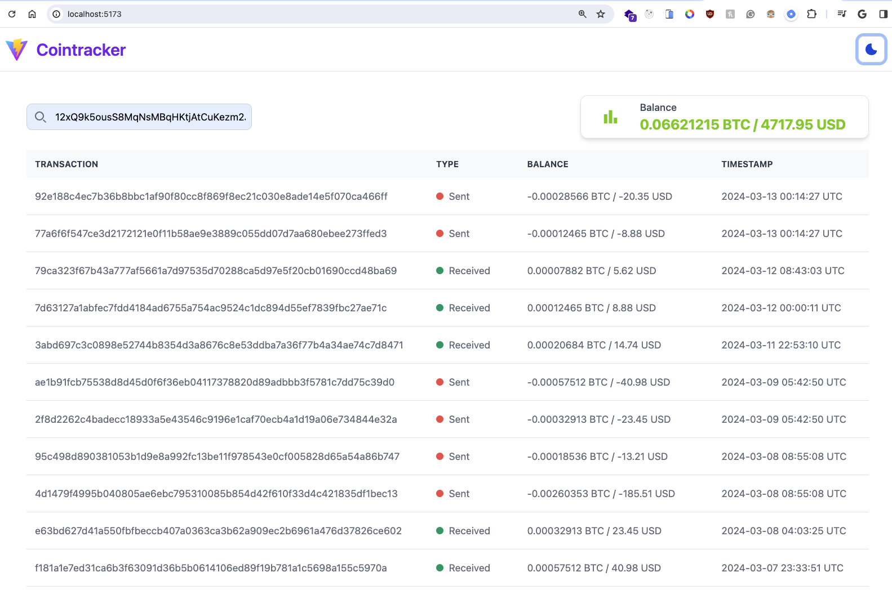

# Cointracker

Cointracker is a full-stack application for tracking cryptocurrency balances. It uses a Python backend and a React + TypeScript frontend.

- The app should let the user:
    - Add/Remove bitcoin addresses
    - Synchronize bitcoin wallet transactions for the addresses
    - Retrieve the current balances and transactions for each transaction

## Project Structure

The project is divided into two main parts:

- `backend/`: Contains the Python FastAPI backend server code.
- `frontend/`: Contains the React + TypeScript frontend code.

## Getting Started

### Prerequisites

- Docker
- Docker Compose

### Installation

1. Clone the repo
```sh
git clone https://github.com/yourusername/cointracker.git
```

2. Build and run the Docker containers
```sh
docker-compose up --build
```

### Usage
Open your web browser and navigate to http://localhost:5173 to see the application in action.

- Sample BTC addresses:
    - [3E8ociqZa9mZUSwGdSmAEMAoAxBK3FNDcd](https://www.blockchain.com/btc/address/3E8ociqZa9mZUSwGdSmAEMAoAxBK3FNDcd)
    - [bc1q0sg9rdst255gtldsmcf8rk0764avqy2h2ksqs5](https://www.blockchain.com/btc/address/bc1q0sg9rdst255gtldsmcf8rk0764avqy2h2ksqs5)
    - Large addresses with transfers: assume [bc1qm34lsc65zpw79lxes69zkqmk6ee3ewf0j77s3h](https://blockchair.com/bitcoin/address/bc1qm34lsc65zpw79lxes69zkqmk6ee3ewf0j77s3h) (156,000+ transactions) and [12xQ9k5ousS8MqNsMBqHKtjAtCuKezm2Ju](https://blockchair.com/bitcoin/address/12xQ9k5ousS8MqNsMBqHKtjAtCuKezm2Ju) (900+ transactions) belong to the same user.

